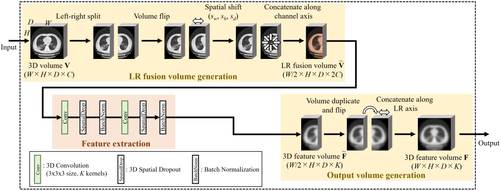

# Left-Right Relationship-Aware 3D Volume Classification Method

Authors: Masahiro Oda, Yuichiro Hayashi, Yoshito Otake, Masahiro Hashimoto, Toshiaki Akashi, Shigeki Aoki, Kensaku Mori 
Journal: International Journal of Computer Assisted Radiology and Surgery

[ :scroll: [`Paper`](https://arxiv.org/??)]

  

# Code

**lungclassify_train.py** 
Main processes of 3D volume load, model traininig, and evaluation.

**models.py** 
Contains model definitions.

**utils.py** 
Contains sub functions used to run main processes.
